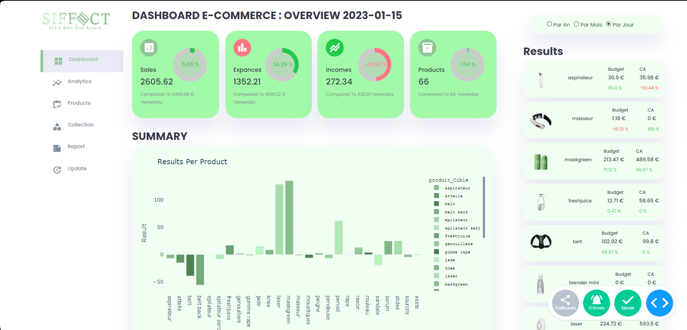

# E-commerce Business Analytics Dashboard

A comprehensive dashboard built to empower e-commerce businesses by providing data-driven insights. This dashboard integrates data from Google Ads and Shopify to offer an in-depth analysis of sales, expenses, and product-specific performance.

## Features
- Real-time Comparisons: View sales, expenses, and income metrics in real-time and see how they compare to previous data.

- Product-specific Insights: Detailed analysis of each product showcasing budget vs. actual sales, allowing businesses to understand their product performance better.

- Integrated Data: Combines information from Google Ads and Shopify to provide a complete overview of your e-commerce business.

- User-friendly Interface: Designed with usability in mind, the dashboard presents data in a visually appealing and easy-to-understand format.
